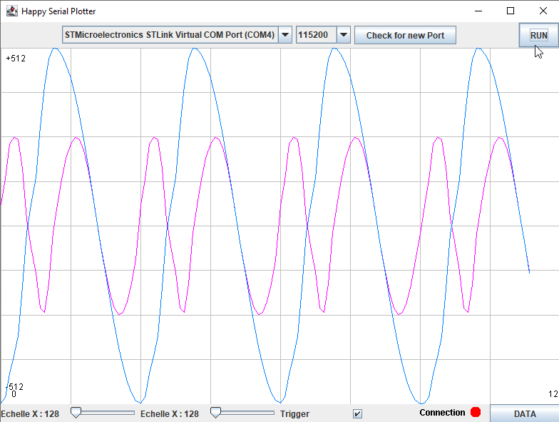

# Serial Plotter ENSEA 2024-205
## A small serial plotter by A. Tauvel

This serial plotter is intended for a single data flow. It relies on the jSerial Library.

You can either download the whole code or just the .jar situated in /out/artifacts/serialPlotter.

**Actual known issue** : the connection is not stable enough. You might need to RUN / STOP the connection to have it functionning. Working on it.

Functionalities :
- Actualisation of the COM Port List.
- Two flows of data supported. Channel A is in Magenta, Channel B is in light Blue.
- XScale is actually the circular buffer size. When changed, it is cleared so the display is rescalled too.
- YScale range from 128 to 2048. 0 value is allways in the center of the screen.
- The Data button toggle ON/OFF data text display. It only displays Channel A.
- The trigger is pretty simple and works only on channel A value.
- Connection has three colors : GREEN is OK, RED is port closed, ORANGE is when the port is open but no data seems to arrive. 

The program supports three data syntax : 
- **%d\n** is a single value, channel A.
- **%d\t%d\n** is channel A and next channel B
- **%d\t%d\t%d\n** is timeStamp, channel A and finally channel B.

Two screenshot : 
This first one has been obtained with ELF code test at 115200 bps and show timing problems

The second one has been obtained with ELF code test at 1000000 (1Mbps) and has no timing problems.

The code is poorly commented...

Enjoy and feel free to make pull request.

A.T.
